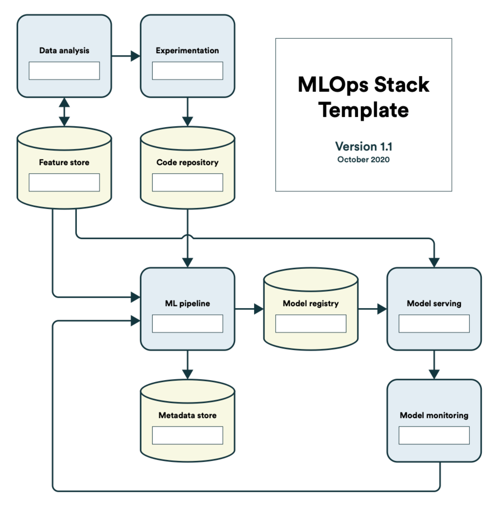

# MLOps Stack Template

**MLOps is a set of best practices that revolve around making machine learning in production more seamless**

This picture was taken from  [state-of-mlops](https://ml-ops.org/content/state-of-mlops)
# MLFlow vs AOA
Here's our comparison MLFlow with AOA
<table>
  <tr>
    <td></td>
    <td>MLFlow</td>
    <td>AOA</td>
  </tr>
  <tr>
    <td>Experiment tracking and comparison</td>
    <td>Realized with MLflow Tracking API+UI
Can be used within code and notebooks
Automatically keeps track of parameters, metrics, code, and models from each expirement</td>
    <td>AOA is not about tracking, there is no tracking API, by the way after training and evaluating model you will get some statistics (metrics, graphics, datasets) of your model</td>
  </tr>
  <tr>
    <td>Code repository</td>
    <td>?</td>
    <td>Git</td>
  </tr>
  <tr>
    <td>Model registry</td>
    <td>In UI or API</td>
    <td>UI</td>
  </tr>
  <tr>
    <td>Storage</td>
    <td>MLflow Tracking Server offers two types of storage:
- database-backed store: experiment and run metadata as well as params, metrics, and tags for runs
- file store: large data, log of artifact output (eg models)

Supports:
- local file paths, NFS, NFTP
- Amazon S3, Azure Blob Storage, Google Cloud Storage</td>
    <td>Only one type of storage:

- Amazon S3</td>
  </tr>
  <tr>
    <td>Logging and debugging</td>
    <td>Automatic logging via mlflow.autolog() 
Library-specific auto log calls available (eg pytorch, fastai, scikit-learn..)
Runs can be annotated via tags
No specific debugging information found </td>
    <td>No automatic logging
Runs can be annotated via tags
No specific debugging information found </td>
  </tr>
  <tr>
    <td>Visualization</td>
    <td>Good GUI to compare and select models
Experiment-based run listing and comparison
Searching for runs by parameter or metric value
Visualizing run metrics
Downloading run results</td>
    <td>Same as MLFlow but you can’t search for runs by parameter or metric value</td>
  </tr>
  <tr>
    <td>Model serving</td>
    <td>Served via concept of flavors, thus models can be processed by different downstream tools
Variety of tools to deploy models (eg. a TensorFlow model can be loaded as a TensorFlow DAG, or as a Python function to apply to input data.)
Tools to deploy many common model types to diverse platforms: e.g model supporting the «Python function» flavor can be deployed to a Docker-based REST server or to cloud platforms such as Azure ML and AWS </td>
    <td></td>
  </tr>
  <tr>
    <td>User authentication </td>
    <td>Open source mlflow doesn’t support that. You get that functionality in Databricks</td>
    <td>+</td>
  </tr>
  <tr>
    <td>Projects</td>
    <td>You can run project locally from your computer </td>
    <td>Only on teradata server</td>
  </tr>
  <tr>
  <td>Model monitoring</td>
  <td>Open source mlflow doesn't support that. You get that functionality by using <a href="https://evidentlyai.com/">evidently</a></td>
  <td>+</td>
  </tr>
  
</table>

