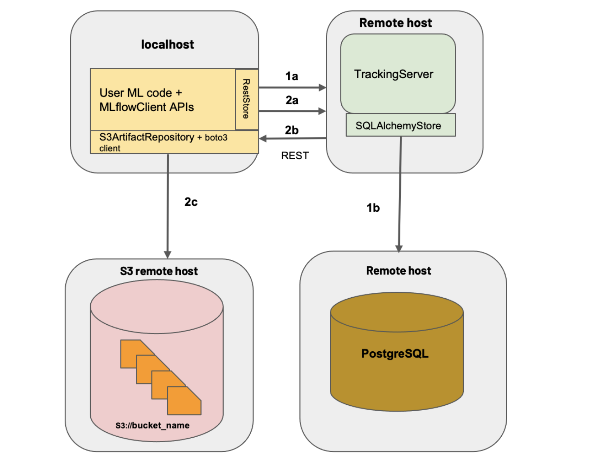

# MLFlow models tracking

----------------------------------

## Tracking
Look either directly there or in `rfcmodel/run_RFCmodel.py` in order to see how the code must be written in order to work with MLflow:
   ```
    mlflow.set_tracking_uri("http://localhost:5000") 
    ...
    ...
    mlflow.log_param("n_estimators", n_estimators)
    mlflow.log_param("max_depth", max_depth)
    mlflow.log_param("max_features", max_features)

    mlflow.log_metric("accuracy", accuracy)
    mlflow.log_metric("precision", precision)
    mlflow.log_metric("recall", recall)
    mlflow.log_metric("f1", f1)
    mlflow.log_metric("auc", auc)

    mlflow.sklearn.log_model(model, "rfcmodel")
```
The MLflow tracking APIs logs information about each training run, which includes hyperparameters `n_estimators`, `max_features` and `max_depth` and the metrics `accuracy`, `precision`, `recall`, `f1` and `auc`.
By default, wherever you run your program, the tracking API writes data into files into a local `./mlruns` directory.
## Server architecture

`mlflow server -h 0.0.0.0 --backend-store-uri postgresql://<your_postgres_user>:<password>@localhost/<db_name> --default-artifact-root <your_s3_bucket>`
* `-h 0.0.0.0` means thats it's not gonna be local server and everyone can access to it
* `--backend-store-uri` is where MLflow Tracking Server stores experiment and run metadata as well as params, metrics, and tags for runs.
* `--default-artifact-root` to configure default location to server’s artifact store. 


# MLFlow models

----------------------------------

## Model registry
1. From the MLflow Runs detail page, select a logged MLflow Model in the Artifacts section. 
    Click the Register Model button. 
2. You can use the `mlflow.<model_flavor>.log_model() `:
    ``` 
        # Log the sklearn model and register as version 1
        mlflow.sklearn.log_model(
            sk_model=sk_learn_rfr,
            artifact_path="sklearn-model",
            registered_model_name="sk-learn-random-forest-reg-model"
        )
    ```
3. ` mlflow.register_model()` method, after all your experiment runs complete and when you have decided which model is most suitable to add to the registry. For this method, you will need the run_id as part of the runs:URI argument.
   ``` 
    result = mlflow.register_model("runs:/d16076a3ec534311817565e6527539c0/sklearn-model",
    "sk-learn-random-forest-reg") 
   ```
4. ` create_registered_model()`  to create a new registered model. If the model name exists, this method will throw an MlflowException because creating a new registered model requires a unique name.
    ``` 
    from mlflow.tracking import MlflowClient
    client = MlflowClient()
    client.create_registered_model("sk-learn-random-forest-reg-model")
   ```
   While the method above creates an empty registered model with no version associated, the method below creates a new version of the model.
   ```
    client = MlflowClient()
    result = client.create_model_version(
    name="sk-learn-random-forest-reg-model",
    source="mlruns/0/d16076a3ec534311817565e6527539c0/artifacts/sklearn-model",
    run_id="d16076a3ec534311817565e6527539c0")

    ```
## Model serving
After you have registered an MLflow model, you can serve the model as a service on your host.
``` 
#!/usr/bin/env sh

# Set environment variable for the tracking URL where the Model Registry resides
export MLFLOW_TRACKING_URI=http://localhost:5000

# Serve the production model from the model registry
mlflow models serve -m "models:/sk-learn-random-forest-reg-model/Production"
```
## Deploy MLFlow models
MLflow can deploy models locally as local REST API endpoints or to directly score files. In addition, MLflow can package models as self-contained Docker images with the REST API endpoint. The image can be used to safely deploy the model to various environments such as Kubernetes.

You deploy MLflow model locally or generate a Docker image using the CLI interface to the `mlflow.models` module.

The REST API server accepts the following data formats as `POST` input to the `/invocations` path:

* JSON-serialized pandas DataFrames in the `split` orientation. For example, `data = pandas_df.to_json(orient='split')`. This format is specified using a `Content-Type` request header value of `application/json` or `application/json; format=pandas-split`.

* JSON-serialized pandas DataFrames in the `records` orientation. This format is specified using a `Content-Type` request header value of `application/json; format=pandas-records`.

    >We do not recommend using this format because it is not guaranteed to preserve column ordering. 

* CSV-serialized pandas DataFrames. For example, `data = pandas_df.to_csv()`. This format is specified using a Content-Type request header value of `text/csv`.

* Tensor input formatted as described in TF Serving’s API docs where the provided inputs will be cast to Numpy arrays. This format is specified using a `Content-Type` request header value of `application/json` and the `instances` or `inputs` key in the request body dictionary.

### Command line interface
MLflow also has a CLI that supports the following commands:

* `serve` deploys the model as a local REST API server.

* `build_docker` packages a REST API endpoint serving the model as a docker image.
  ``` 
  Builds a Docker image whose default entrypoint serves the
  specified MLflow model at port 8080 within the container, using the
  'python_function' flavor.
    ```

* `predict` uses the model to generate a prediction for a local CSV or JSON file. Note that this method only supports DataFrame input.


