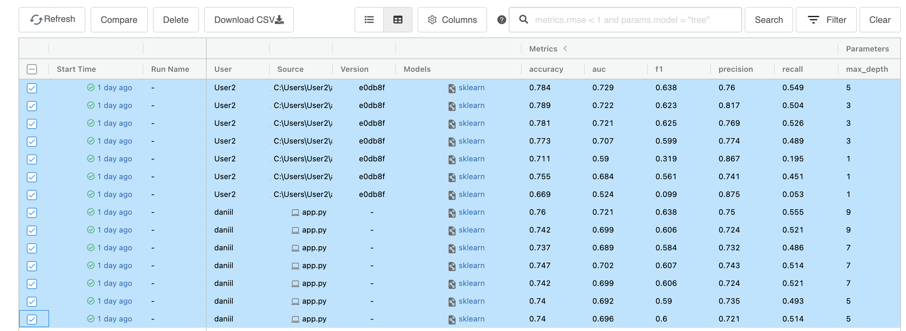
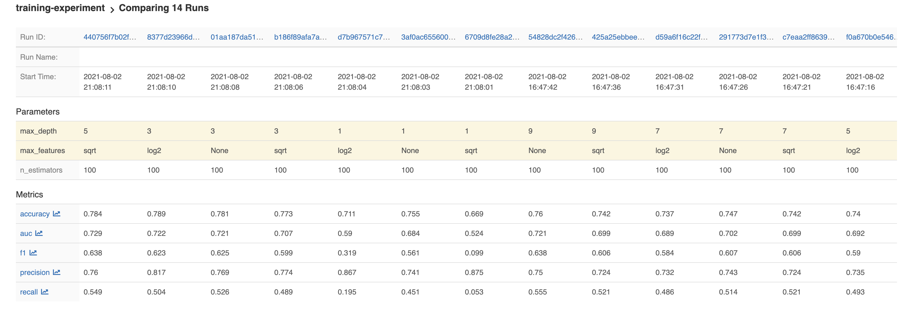
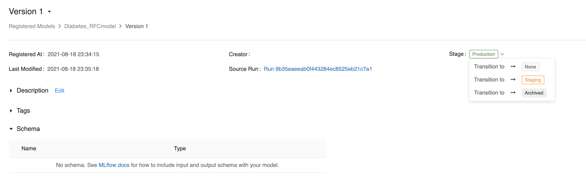

# MLFlow models tracking

----------------------------------

## Server architecture

`mlflow server -h 0.0.0.0 --backend-store-uri postgresql://<your_postgres_user>:<password>@localhost/<db_name> --default-artifact-root <your_s3_bucket>`
* `-h 0.0.0.0` means thats it's not gonna be local server and everyone can access to it
* `--backend-store-uri` is where MLflow Tracking Server stores experiment and run metadata as well as params, metrics, and tags for runs.
* `--default-artifact-root` to configure default location to server’s artifact store. 

## Experiment
Experiment contains metadata and artifacts


## Tracking
Look either directly there or in `rfcmodel/run_RFCmodel.py` in order to see how the code must be written in order to work with MLflow:
   ```
    mlflow.set_tracking_uri("http://localhost:5000") 
    ...
    ...
    mlflow.log_param("n_estimators", n_estimators)
    mlflow.log_param("max_depth", max_depth)
    mlflow.log_param("max_features", max_features)

    mlflow.log_metric("accuracy", accuracy)
    mlflow.log_metric("precision", precision)
    mlflow.log_metric("recall", recall)
    mlflow.log_metric("f1", f1)
    mlflow.log_metric("auc", auc)

    mlflow.sklearn.log_model(model, "rfcmodel")
```
* `mlflow.set_tracking_uri()` - Set the tracking server URI
* `mlflow.log_param()` - Log a parameter under the current run
* `mlflow.log_metric()` - Log a metric under the current run.

The MLflow tracking APIs logs information about each training run, which includes hyperparameters `n_estimators`, `max_features` and `max_depth` and the metrics `accuracy`, `precision`, `recall`, `f1` and `auc`.
By default, wherever you run your program, the tracking API writes data into files into a local `./mlruns` directory.

### Models comparing




# MLFlow models
An MLflow Model is a standard format for packaging machine learning models that can be used in a variety of downstream tools—for example, real-time serving through a REST API or batch inference on Apache Spark. The format defines a convention that lets you save a model in different “flavors” that can be understood by different downstream tools.

----------------------------------

## Model registry
The MLflow Model Registry component is a centralized model store, set of APIs, and UI, to collaboratively manage the full lifecycle of an MLflow Model. It provides model lineage (which MLflow experiment and run produced the model), model versioning, stage transitions (for example from staging to production), and annotations.
### How to register model
1. From the MLflow Runs detail page, select a logged MLflow Model in the Artifacts section. 
    Click the Register Model button and set the model name. In our example model name is `Diabetes_RFCmodel` 
2. You can use the `mlflow.<model_flavor>.log_model() `:
    ``` 
        # Log the sklearn model and register as version 1
        mlflow.sklearn.log_model(
            sk_model=sk_learn_rfr,
            artifact_path="sklearn-model",
            registered_model_name="Diabetes_RFCmodel"
        )
    ```
3. ` mlflow.register_model()` method, after all your experiment runs complete and when you have decided which model is most suitable to add to the registry. For this method, you will need the run_id as part of the runs:URI argument.
   ``` 
    result = mlflow.register_model("runs:/d16076a3ec534311817565e6527539c0/sklearn-model",
    "Diabetes_RFCmodel") 
   ```
4. ` create_registered_model()`  to create a new registered model. If the model name exists, this method will throw an MlflowException because creating a new registered model requires a unique name.
    ``` 
    from mlflow.tracking import MlflowClient
    client = MlflowClient()
    client.create_registered_model("Diabetes_RFCmodel")
   ```
   While the method above creates an empty registered model with no version associated, the method below creates a new version of the model.
   ```
    client = MlflowClient()
    result = client.create_model_version(
    name="Diabetes_RFCmodel",
    source="mlruns/0/d16076a3ec534311817565e6527539c0/artifacts/sklearn-model",
    run_id="d16076a3ec534311817565e6527539c0")

    ```
After registering model you can set model stage at model page

## Model serving
After you have registered an MLflow model, you can serve the model as a service on your host.
``` 
#!/usr/bin/env sh

# Set environment variable for the tracking URL where the Model Registry resides
export MLFLOW_TRACKING_URI=http://localhost:5000

# Serve the production model from the model registry
mlflow models serve -m "models:/Diabetes_RFCmodel/Production"
```


## Inferencing deployed models
MLflow can deploy models locally as local REST API endpoints or to directly score files. In addition, MLflow can package models as self-contained Docker images with the REST API endpoint. The image can be used to safely deploy the model to various environments such as Kubernetes.

You deploy MLflow model locally or generate a Docker image using the CLI interface to the `mlflow.models` module.

The REST API server accepts the following data formats as `POST` input to the `/invocations` path:

* JSON-serialized pandas DataFrames in the `split` orientation. For example, `data = pandas_df.to_json(orient='split')`. This format is specified using a `Content-Type` request header value of `application/json` or `application/json; format=pandas-split`.

* JSON-serialized pandas DataFrames in the `records` orientation. This format is specified using a `Content-Type` request header value of `application/json; format=pandas-records`.

    >We do not recommend using this format because it is not guaranteed to preserve column ordering. 

* CSV-serialized pandas DataFrames. For example, `data = pandas_df.to_csv()`. This format is specified using a Content-Type request header value of `text/csv`.

* Tensor input formatted as described in TF Serving’s API docs where the provided inputs will be cast to Numpy arrays. This format is specified using a `Content-Type` request header value of `application/json` and the `instances` or `inputs` key in the request body dictionary.

### Additional options of serving
MLflow also has a CLI that supports the following commands:

* `serve` deploys the model as a local REST API server.

* `build_docker` packages a REST API endpoint serving the model as a docker image.
  ``` 
  Builds a Docker image whose default entrypoint serves the
  specified MLflow model at port 8080 within the container, using the
  'python_function' flavor.
    ```

* `predict` uses the model to generate a prediction for a local CSV or JSON file. Note that this method only supports DataFrame input.
# MLFlow projects
An MLflow Project is a format for packaging data science code in a reusable and reproducible way, based primarily on conventions. In addition, the Projects component includes an API and command-line tools for running projects, making it possible to chain together projects into workflows.

MLflow currently supports the following project environments: 
* Conda environment 
* Docker container environment 
* System environment
## MLproject file
You can get more control over an MLflow Project by adding an `MLproject` file, which is a text file in `YAML` syntax, to the project’s root directory. The following is an example of an `MLproject` file:
```
name: My Project

conda_env: my_env.yaml
# Can have a docker_env instead of a conda_env, e.g.
# docker_env:
#    image:  mlflow-docker-example

entry_points:
  main:
    parameters:
      data_file: path
      regularization: {type: float, default: 0.1}
    command: "python train.py -r {regularization} {data_file}"
  validate:
    parameters:
      data_file: path
    command: "python validate.py {data_file}"
```
The file can specify a name and a Conda or Docker environment, as well as more detailed information about each entry point. Specifically, each entry point defines a command to run and parameters to pass to the command (including data types).
## Specifying the environment
This section describes how to specify Conda and Docker container environments in an MLproject file. MLproject files cannot specify both a Conda environment and a Docker environment.
* Conda environment
    
    Include a top-level `conda_env` entry in the `MLproject` file. The value of this entry must be a relative path to a Conda environment YAML file within the MLflow project’s directory. In the following example:
    
    `conda_env: files/config/conda_environment.yaml`
* Docker container environment
    
    Include a top-level `docker_env` entry in the `MLproject` file. The value of this entry must be the name of a Docker image that is accessible on the system executing the project; this image name may include a registry path and tags. Here are a couple of examples.
    * Image without a registry path
    
        `docker_env:
            image: mlflow-docker-example-environment`
    * Mounting volumes and specifying environment variables
        
        ```
      docker_env:
              image: mlflow-docker-example-environment
              volumes: ["/local/path:/container/mount/path"]
              environment: [["NEW_ENV_VAR", "new_var_value"], "VAR_TO_COPY_FROM_HOST_ENVIRONMENT"]
      ```
    * Image in a remote registry
    
        ```
        docker_env:
            image: 012345678910.dkr.ecr.us-west-2.amazonaws.com/mlflow-docker-example-environment:7.0
      ```
## Running projects
MLflow provides two ways to run projects: the mlflow run `command-line tool`, or the `mlflow.projects.run()`

You can't run mlflowproject if `mlflowproject` file and `conda.env` aren't in repository root.

To run project use this command:

`mlflow run https://github.com/plaguedoctor39/mlflowproject-test -P depth=5`

Output:
```
...
...
INFO mlflow.projects: === Run (ID '59e4456c246542988b6c478debd22f57') succeeded ===
```
Now you can use command `mlflow ui` to see if there is our run

## Evidently + MLFlow
You can use Evidently to calculate metrics, and MLflow Tracking to log and view the results
### Overview
Many machine learning teams use `MLflow` for experiment management, deployment, and as a model registry.  If you are already familiar with MLflow, you can integrate it with Evidently to ***track the performance of production models***. 

In this case, you use `Evidently` to calculate the metrics and `MLflow` to log the results. You can then access the metrics in the `MLflow` interface. 
### How it works
Evidently calculates a rich set of metrics and statistical tests.
You can choose any of the pre-built [reports](https://docs.evidentlyai.com/reports) to define the metrics you’d want to get. 
 
You can then generate a JSON profile that will contain the defined metrics output. 
You can combine several profile sections (e.g., Data and Prediction Drift together). 

You might not always need all metrics from the profile. You should explicitly define which parts of the output to send to MLflow Tracking.   
